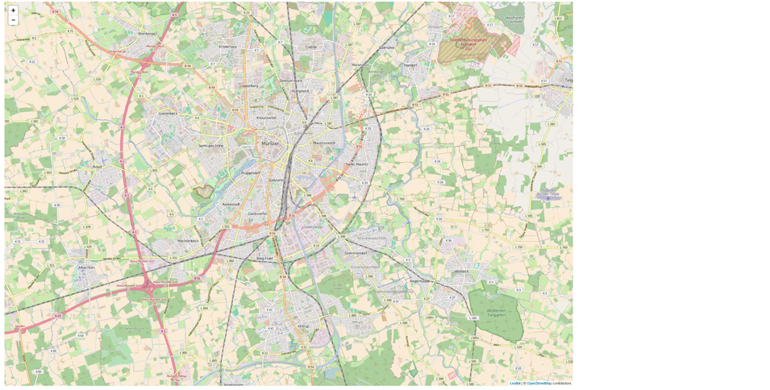
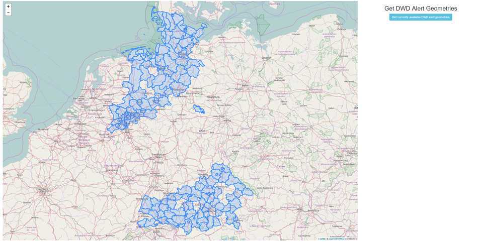
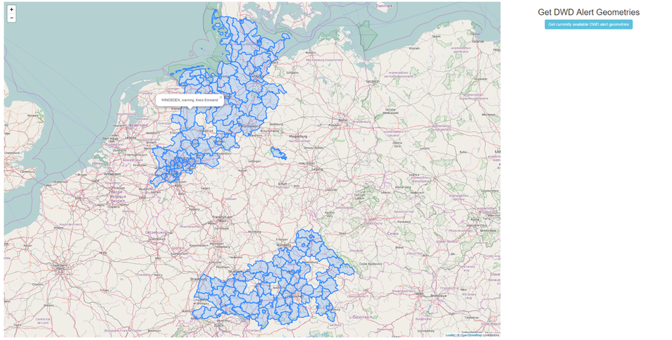

# Tutorial: DWD Alerts

This tutorial is about weather alert data produced by the DWD (Deutscher Wetter Dienst - German Weather Service). It will guide you to use the series-REST-api to:

1. retrieve **geometries** and display them on a map
2. retrieve **platforms** and show a property using a leaflet popup

## Use Case and Motivation

Let us imagine, the climate of the past days has been quite hot and sultry. You fear a consequential thunderstorm and want to check for current weather alerts produced by DWD.

The DWD analyzes weather data and, if there is a potential thread, creates alert messages. For this reason, the DWD divides the whole area of Germany into numerous cells. For each cell the weather analysis algorithm might produce an alert.

52°North host a demo instance at <http://ows.dev.52north.org:8080/dwd-harvester-webapp/api/v1/>, which harvests current DWD alert data and enables clients to retrieve it via a REST interface (the suffix 'api/v1/' is the entry point to the REST API). If there are no current alerts, then the SOS-instance will return empty result sets for each service URL presented in this tutorial.

As a starting point for our tutorial, we want to query and visualize all geometries of affected DWD alert cells using the Series-REST-api. Conceptually, each returned item reflects the geometry of an observed area of a sensor platform.

As a second step, we want to query the actual alert message, which is provided as a property of the sensor platform that belongs to the geometry.

## Technical Approach

This sections presents a step-by-step guide to make use of the Series-REST-api to retrieve sensor data and display it on a map. Following this tutorial you will create a simple HTML-Application displaying current DWD alert data.

First, we start with an overview of the project layout:

```
dwd_folder
  |
  -- dwd-tutorial.html
  -- app.css
  -- app.js
```

In the beginning, **app.css** and **app.js** are empty and our **dwd-tutorial.html** should look like:

```
<!DOCTYPE html>
<html>
  <head>
    <meta charset="ISO-8859-1"> </meta>
    <title>DWD Alerts Tutorial</title>

    <!-- application css and js files -->
        <link rel="stylesheet" href="app.css"> </link>
        <script src="app.js"> </script>

  </head>
  <body>
  </body>
</html>
```

### External JS Libraries

For our simple demo, we use the external JavaScript libraries JQuery, Bootstrap and Leaflet. Let us add the necessary js- and css-files to **dwd-tutorial.html**:

```

  <head>

    <!-- JQuery for easier element access and execute Web requests -->
    <script src="https://ajax.googleapis.com/ajax/libs/jquery/1.12.4/jquery.min.js"> </script>

    <!-- Bootstrap for beautification and page layout -->
    <link rel="stylesheet" href="https://maxcdn.bootstrapcdn.com/bootstrap/3.3.7/css/bootstrap.min.css"> </link>

    <script src="https://maxcdn.bootstrapcdn.com/bootstrap/3.3.7/js/bootstrap.min.js"> </script>

    <!-- Leaflet to display a map -->
    <link rel="stylesheet" href="https://npmcdn.com/leaflet@1.0.0-rc.2/dist/leaflet.css"> </link>

    <script src="https://npmcdn.com/leaflet@1.0.0-rc.2/dist/leaflet.js"> </script>

  </head>
```

### Basic Page Layout using Bootstrap

Within our application, we intend to embed a large map area and a small area for form elements. Bootstrap provides a simple mechanism to divide the page into distinct areas through the definition of classified div-containers.

We define the layout within the body of our **dwd-tutorial.html** as follows:

```
<body>
  <!-- simple Bootstrap layout; use 9/12 of width for map and 3/12 for form-->
  <div class="row" id="applicationContainer">
    <div class="col-sm-9" id="mapArea">

      <!-- maparea -->

    </div>
    <div class="col-sm-3" id="formArea">

      <!-- form area -->

    </div>
  </div>
</body>
```

In addition we define a small border for our application in **app.css**:

```
#applicationContainer{
   margin-top: 10px;
   margin-left: 5px;
   margin-right: 5px;
   margin-bottom: 5px;
}
```

With this basic setup we can concentrate on adding the interesting stuff.

### Map Integration

To display the queried sensor data on a map, we use Leaflet to embed an interactive map into our application. To do that we first add a necessary div-element into the div-element with id="mapArea" of our **dwd-tutorial.html**:

```
<div class="col-sm-9" id="mapArea">

  <!-- div container for leaflet map -->  
  <div id="mapid"> </div>

</div>
```

To initialize the map on startup, we utilize JQuery's `ready()`-function, which is executed once the DOM is completely loaded. add the following code to **app.js**:

```
//variable for leaflet map
var myMap;

//executed once DOM is loaded
$( document ).ready(function() {

     // initialize map.
     myMap = L.map('mapid').setView([51.946, 7.635], 13);

     // define Open Street Map layer
     L.tileLayer('http://{s}.tile.osm.org/{z}/{x}/{y}.png', {
          attribution: '© <a href="http://osm.org/copyright">OpenStreetMap</a> contributors'
     }).addTo(myMap);

});
```

Finally, to specify the height of our map, add the following entry to **app.css**:

```
#mapid {
  height: 98vh;
}
```

Now, when you open the **dwd-tutorial.html** in a browser, you should be greeted with a large leaflet map showing Open Street Map data.



### Retrieve and Display Geometries of DWD Cells

Now we actually get in contact with the REST-api. What we want to do is to query the SOS instance for geometries of current DWD alerts. In order to retrieve the geometries using the Series-REST-api, there is a dedicated endpoint named

```
  /geometries
```

So adding that endpoint to the base URL of the API instance will provide us with a JSON encoded description of all available geometries.

```
    http://ows.dev.52north.org:8080/dwd-harvester-webapp/api/v1/geometries
```

For instance, a returned geometry item might could look like:

```
{
  "href": "http://ows.dev.52north.org:8080/dwd-harvester-webapp/api/v1/geometries/platform_site_101001000",
  "id": "platform_site_101001000",
  "geometryType": "platform_site",
  "platform": {
    "id": "platformary_insitu_101001000",
    "href": "http://ows.dev.52north.org:8080/dwd-harvester-webapp/api/v1/platforms/platformary_insitu_101001000",
    "domainId": "101001000",
    "label": "Stadt Flensburg",
    "platformType": "platformary_insitu"
  }
}
```

As you notice, the actual geometry is not included in this response item. To get it we could append the ID of the returned geometry item to the REST URL and get the following result, which is an extended description of a single geometry-item in GeoJSON-format.

```
{
  "type": "Feature",
  "id": "platform_site_101001000",
  "properties": {
    "href": "http://ows.dev.52north.org:8080/dwd-harvester-webapp/api/v1/geometries/platform_site_101001000",
    "id": "platform_site_101001000",
    "geometryType": "platform_site",
    "platform": {
      "id": "platformary_insitu_101001000",
      "href": "http://ows.dev.52north.org:8080/dwd-harvester-webapp/api/v1/platforms/platformary_insitu_101001000",
      "domainId": "101001000",
      "label": "Stadt Flensburg",
      "platformType": "platformary_insitu"
    }
  },
  "geometry": {
    "type": "MultiPolygon",
    "coordinates": [
      [
        [
          [
            9.489823260151168,
            54.82296231149822
          ],
          [
            9.504673652057674,
            54.81004002875278
          ],

          ... rest omitted for readability ...
        ]
      ]
    ]
  }
}
```

Alternatively, we can add the query parameter 'expanded=true' to the URL. This will encode all available geometries directly in the extended GeoJSON-format. To verify this, try out the following request (remember, if you get an empty set of items, then there are currently no DWD alerts):

```
http://ows.dev.52north.org:8080/dwd-harvester-webapp/api/v1/geometries?expanded=true
```

Now let us use this knowledge and extend our application with the functionality to retrieve and display all current DWD alert geometries.

First, let us add a button inside the formArea-div of our **dwd-tutorial.html**:

```
<div class="col-sm-3" id="formArea" align="center">

            <h2>Get DWD Alert Geometries</h2>

            <!-- button to query available geometries -->
            <button type="button" class="btn btn-info" onclick="getAllGeometries()">Get currently available DWD alert geometries</button>

</div>
```

The onclick-event points to the function 'getAllGeometries()', which we have to implement in our **app.js** as follows:

```
// BASE URL OF API INSTANCE
var baseUrl = "http://ows.dev.52north.org:8080/dwd-harvester-webapp/api/v1";


// RETRIEVE ALL GEOMETRIES OF DWD ALERTS

/*
 * function to retrieve all geometries
 *
 * note that if there currently are no DWD alerts, then the request
 * will result in an empty set of returned items.
 *
 */  
var getAllGeometries = function(){

    // REST URL to retrieve all currently available DWD geometries
    var allGeometriesRequestUrl = baseUrl + "/geometries?expanded=true";

    // use jquery.ajax() to execute request
    jQuery.ajax( allGeometriesRequestUrl, {

        dataType : "json",
        success : allGeometriesCallback
    })
}
```

The code snippet above also adds the variable 'baseUrl', which is used to store the base endpoint of the SOS instance. Inside the method 'getAllGeometries()', we use JQuery to execute an ajax-request against the REST endpoint '/geometries?expanded=true'. The success option delegates the result to another method named 'allGeometriesCallback', which in turn delegates the visualization to a method called 'visualizeGeometriesOnMap', as shown in the following snippet:

```
var allGeometriesCallback = function(geoJSONfeatures) {

    if(geoJSONfeatures.length === 0){
        alert("Currently there are no weather alers produced by the DWD (Deutscher Wetter Dienst - German Weather Service! Consequentially, no geometries can be displayed)");
    }
    else{
        // visualize all geometries on map
    visualizeGeometriesOnMap(geoJSONfeatures);
    }
}

// VISUALIZE GEOMETRIES

// geoJSON layer for leaflet map; used to add retrieved geometries
var geoJSONlayer;

var visualizeGeometriesOnMap = function(geoJSONfeatures){

    for (var index=0; index< geoJSONfeatures.length; index++){
        var geoJSONfeature = geoJSONfeatures[index];

        // check if feature is missing geoJSON properties
        if(!(geoJSONfeature.type && geoJSONfeature.geometry)){

            // remove feature from array
            geoJSONfeatures.splice(index, 1);

        }
    }

    //remove old layer
    if(myMap.hasLayer(geoJSONlayer))
        myMap.removeLayer(geoJSONlayer);

    // add remaining geoJSON features to map
    geoJSONlayer = L.geoJson(geoJSONfeatures).addTo(myMap);

    //zoom to extent of added features
    zoomToAllFeatures();
}


// ZOOM TO ALL AVAILABLE FEATURES

var zoomToAllFeatures = function(){
    var bounds = L.latLngBounds([]);

    var layerBounds = geoJSONlayer.getBounds();
    // extend the bounds of the collection
    // to fit the bounds of all features
    bounds.extend(layerBounds);

     // apply bounds to map variable
     myMap.fitBounds(bounds);
}
```

The new variable 'geoJSONlayer' has been introduced as a reference to a geoJSON-layer that is added to the leaflet map and which stores our retrieved geometries. Inside the method 'visualizeGeometriesOnMap', we first remove all features from the feature array that are missing required GeoJSON properties. The remaining features are added to the leaflet map. Subsequently, we automatically zoom to the maximum feature extent with the help of the reference to the 'geoJSONlayer'.

Having added the above snippets to the respective files we can click on the new button and retrieve current DWD alert geometries. The following figure shows an exemplar set of geometries:



### Retrieve DWD Alert Messages

Now that we can see geometries of current DWD alerts, it would be fancy to click on a geometry and show the respective alert message as a popup. The necessary information is available on the corresponding **platform** of the geometry. In general, a **platform** represents the sensor that observed the phenomenon. For instance, the previously presented exemplar geometry has a reference to the platform with the ID 'platformary_insitu_101001000' (look under 'properties.platform') as shown below.

```
{
  "type": "Feature",
  "id": "platform_site_101001000",
  "properties": {
    "href": "http://ows.dev.52north.org:8080/dwd-harvester-webapp/api/v1/geometries/platform_site_101001000",
    "id": "platform_site_101001000",
    "geometryType": "platform_site",
    "platform": {
      "id": "platformary_insitu_101001000",
      "href": "http://ows.dev.52north.org:8080/dwd-harvester-webapp/api/v1/platforms/platformary_insitu_101001000",
      "domainId": "101001000",
      "label": "Stadt Flensburg",
      "platformType": "platformary_insitu"
    }
  },
  "geometry": {
    "type": "MultiPolygon",
    "coordinates": [
      [
        [
          [
            9.489823260151168,
            54.82296231149822
          ],
          [
            9.504673652057674,
            54.81004002875278
          ],

          ... rest omitted for readability ...
        ]
      ]
    ]
  }
}
```

To query platforms of a SOS via the series-REST-api, we can use the endpoint

```
    /platforms
```

to retrieve an array of all available platforms. To get only a specific platform, we may append its ID to the URL

```
  /platforms/<platform_id>
```

E.g. the corresponding platform for the above geometry is retrieved as follows:

```
http://ows.dev.52north.org:8080/dwd-harvester-webapp/api/v1/platforms/platformary_insitu_101001000


{
  "id": "platformary_insitu_101001000",
  "href": "http://ows.dev.52north.org:8080/dwd-harvester-webapp/api/v1/platforms/platformary_insitu_101001000",
  "domainId": "101001000",
  "label": "Stadt Flensburg",
  "extras": [
    "copyright"
  ],
  "service": {
    "id": "1",
    "label": "DWD Warnings Series Service."
  },
  "platformType": "platformary_insitu",
  "series": [
    {
      "id": "dwd-alert_101001000-STURMBÖEN",
      "href": "http://ows.dev.52north.org:8080/dwd-harvester-webapp/api/v1/datasets/dwd-alert_101001000-STURMBÖEN",
      "label": "STURMBÖEN, warning, Stadt Flensburg",
      "datasetType": "dwd-alert"
    }
  ]
}
```

Inspecting the platform's structure, we identify the alert message in the property 'series[0].label'.

Now let us extend our application to click on a displayed geometry, fetch the corresponding platform from the SOS, extract the alert message and show it as a popup. To do this we have to make the following changes and additions to our **app.js** file:

The method 'visualizeGeometriesOnMap()' has to be slightly modified when adding features to our map:

```
var visualizeGeometriesOnMap = function(geoJSONfeatures){

    for (var index=0; index< geoJSONfeatures.length; index++){
        var geoJSONfeature = geoJSONfeatures[index];

        // check if feature is missing geoJSON properties
        if(!(geoJSONfeature.type && geoJSONfeature.geometry)){

            // remove feature from array
            geoJSONfeatures.splice(index, 1);

        }
    }

    //remove old layer
    if(myMap.hasLayer(geoJSONlayer))
        myMap.removeLayer(geoJSONlayer);

    // add remaining geoJSON features to map
    geoJSONlayer = L.geoJson(geoJSONfeatures, {
            onEachFeature: onEachFeature
        }).addTo(myMap);

    //zoom to extent of added features
    zoomToAllFeatures();
}
```

the method call 'L.geoJson()' has been enriched with an options object declaring a method handler ('onEachFeature') that is executed for each added feature. The corresponding callback is defined as shown below:

```
//ON EACH FEATURE

// helper variable to store the clicked latLong position
var clickedLatLng;

function onEachFeature(feature, layer) {

    //bind click on feature
    layer.on({
        click: fetchAndShowAlertMessage
    });
}

function fetchAndshowAlertMessage(event) {

    // set clicked position
    clickedLatLng = event.latlng;

    // get feature from event
    var feature = event.target.feature;

    // extract platform ID from feature
    var platformId = feature.properties.platform.id;

    // retrieve platform from SOS instance
    // and show popup
    var platform = getPlatform(platformId);
}
```

First, there is a new variable 'clickedLatLng', which is supposed to store the clicked position on the leaflet map.

Next, the function 'onEachFeature()' registers an onClick event handler callback (method 'fetchAlertMessage') that is added to each displayed feature.

The method 'fetchAndShowAlertMessage()' takes the click event, sets the clicked position coordinates, identifies the clicked feature and triggers the retrieval of the corresponding platform.

Finally, to complete the new functionality, we need two more methods, as shown in the next snippet:

```
// RETRIEVE PLATFORM

var getPlatform = function(platformId){

    // REST URL to retrieve all currently available DWD platforms
    var getPlatformRequestUrl = baseUrl + "/platforms/" + platformId;

    // use jquery.ajax() to execute request
    jQuery.ajax( getPlatformRequestUrl, {

        dataType : "json",
        success : getPlatformCallback
    })
}

// show popup
var getPlatformCallback = function(platformData) {

    // extract first alert message
    var alertLabel = platformData.series[0].label;

    // show popup on clicked position
    myMap.openPopup( alertLabel, clickedLatLng);
}
```

Similar to the retrieval of geometries, we use JQuery to execute an ajax-request and register a callback method on the success event to query and process the platform data. In 'getPlatformCallback()' we simply extract the 'label' element of the first 'series' property and enable a popup showing the label's content.

Integrating these modifications and additions into our files we are now able to click on a geometry and display its alert message properly!



To conclude this tutorial, the complete content of each file is presented below:

**dwd-tutorial.html**

```
<!DOCTYPE html>
<html>
    <head>

    <meta charset="ISO-8859-1"> </meta>
    <title>DWD Alerts Tutorial</title>

        <!-- JQuery for easier element access and execute Web requests -->
        <script src="https://ajax.googleapis.com/ajax/libs/jquery/1.12.4/jquery.min.js"> </script>

        <!-- Bootstrap for beautification and page layout -->
        <link rel="stylesheet" href="https://maxcdn.bootstrapcdn.com/bootstrap/3.3.7/css/bootstrap.min.css">

        <script src="https://maxcdn.bootstrapcdn.com/bootstrap/3.3.7/js/bootstrap.min.js"> </script>

        <!-- Leaflet to display a map -->
        <link rel="stylesheet" href="https://npmcdn.com/leaflet@1.0.0-rc.2/dist/leaflet.css">

        <script src="https://npmcdn.com/leaflet@1.0.0-rc.2/dist/leaflet.js"> </script>


        <!-- application css and js files -->
        <link rel="stylesheet" href="app.css">
        <script src="app.js"> </script>

    </head>
    <body>

        <!-- simple Bootstrap layout; use 9/12 of width for map and 3/12 for form-->
        <div class="row" id="applicationContainer">
            <div class="col-sm-9" id="mapArea">

                <!-- div container for leaflet map -->
                <div id="mapid"> </div>

            </div>
            <div class="col-sm-3" id="formArea" align="center">

                <h2>Get DWD Alert Geometries</h2>

                <!-- button to query available geometries -->
                <button type="button" class="btn btn-info" onclick="getAllGeometries()">Get currently available DWD alert geometries</button>

            </div>
        </div>

    </body>
</html>
```

**app.css**

```
#mapid {
    height: 98vh;
}

#applicationContainer{
    margin-top: 10px;
    margin-left: 5px;
    margin-right: 5px;
    margin-bottom: 5px;
}
```

**app.js**

```
//variable for leaflet map
var myMap;

$( document ).ready(function() {
    // initialize map.

    myMap = L.map('mapid').setView([51.946, 7.635], 13);

    L.tileLayer('http://{s}.tile.osm.org/{z}/{x}/{y}.png', {
        attribution: '© <a href="http://osm.org/copyright">OpenStreetMap</a> contributors'
    }).addTo(myMap);

});

// BASE URL OF API INSTANCE
var baseUrl = "http://ows.dev.52north.org:8080/dwd-harvester-webapp/api/v1";


// RETRIEVE ALL GEOMETRIES OF DWD ALERTS

/*
 * function to retrieve all geometries
 *
 * note that if there currently are no DWD alerts, then the request
 * will result in an empty set of returned items.
 *
 */  
var getAllGeometries = function(){

    // REST URL to retrieve all currently available DWD geometries
    var allGeometriesRequestUrl = baseUrl + "/geometries?expanded=true";

    // use jquery.ajax() to execute request
    jQuery.ajax( allGeometriesRequestUrl, {

        dataType : "json",
        success : allGeometriesCallback
    })
}


var allGeometriesCallback = function(geoJSONfeatures) {

    if(geoJSONfeatures.length === 0){
        alert("Currently there are no weather alers produced by the DWD (Deutscher Wetter Dienst - German Weather Service! Consequentially, no geometries can be displayed)");
    }
    else{
        // visualize all geometries on map
    visualizeGeometriesOnMap(geoJSONfeatures);
    }
}

// VISUALIZE GEOMETRIES

// geoJSON layer for leaflet map; used to add retrieved geometries
var geoJSONlayer;

var visualizeGeometriesOnMap = function(geoJSONfeatures){

    for (var index=0; index< geoJSONfeatures.length; index++){
        var geoJSONfeature = geoJSONfeatures[index];

        // check if feature is missing geoJSON properties
        if(!(geoJSONfeature.type && geoJSONfeature.geometry)){

            // remove feature from array
            geoJSONfeatures.splice(index, 1);

        }
    }

    //remove old layer
    if(myMap.hasLayer(geoJSONlayer))
        myMap.removeLayer(geoJSONlayer);

    // add remaining geoJSON features to map
    geoJSONlayer = L.geoJson(geoJSONfeatures, {
            onEachFeature: onEachFeature
        }).addTo(myMap);

    //zoom to extent of added features
    zoomToAllFeatures();
}


// ZOOM TO ALL AVAILABLE FEATURES

var zoomToAllFeatures = function(){
    var bounds = L.latLngBounds([]);


    var layerBounds = geoJSONlayer.getBounds();
    // extend the bounds of the collection
    // to fit the bounds of all features
    bounds.extend(layerBounds);

     // apply bounds to map variable
     myMap.fitBounds(bounds);
}

//ON EACH FEATURE

// helper variable to store the clicked latLong position
var clickedLatLng;

function onEachFeature(feature, layer) {

    //bind click on feature
    layer.on({
        click: fetchAndShowAlertMessage
    });
}

function fetchAndShowAlertMessage(event) {

    // set clicked position
    clickedLatLng = event.latlng;

    // get feature from event
    var feature = event.target.feature;

    // extract platform ID from feature
    var platformId = feature.properties.platform.id;

    // retrieve platform from SOS instance
    // and show popup
    var platform = getPlatform(platformId);
}


// RETRIEVE PLATFORM

var getPlatform = function(platformId){

    // REST URL to retrieve all currently available DWD platforms
    var getPlatformRequestUrl = baseUrl + "/platforms/" + platformId;

    // use jquery.ajax() to execute request
    jQuery.ajax( getPlatformRequestUrl, {

        dataType : "json",
        success : getPlatformCallback
    })
}

// show popup
var getPlatformCallback = function(platformData) {

    // extract first alert message
    var alertLabel = platformData.series[0].label;

    // show popup on clicked position
    myMap.openPopup( alertLabel, clickedLatLng);
}
```
