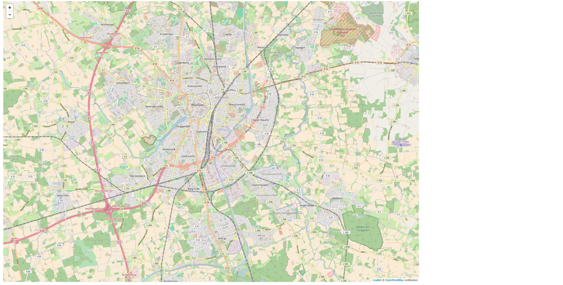
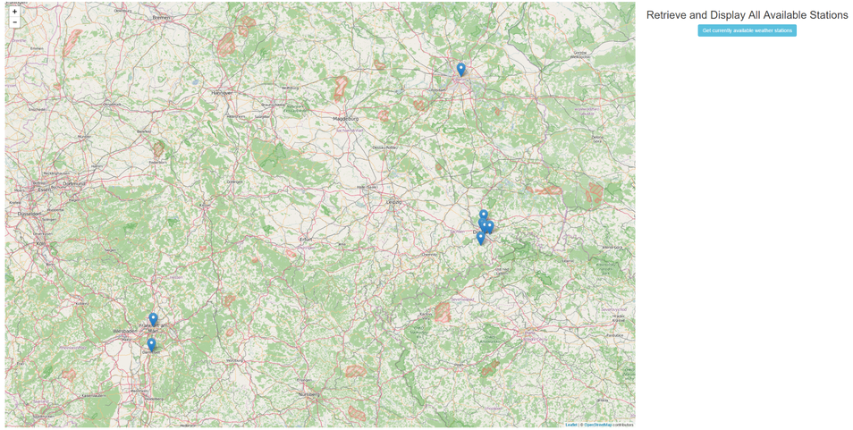
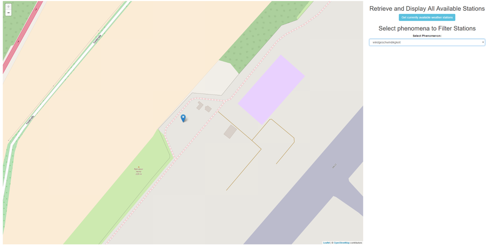
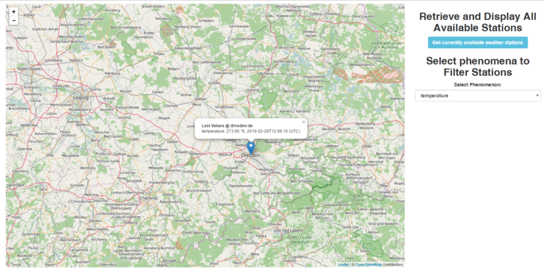

# Tutorial: Last Value of Weather Stations

The goal of this tutorial is to show how to filter the outputs of the series-REST-api.

After reading through it, you will have learned how to:

1. query **platforms** and display them on a map
2. filter **platforms** by certain **phenomena**
3. query the last measured value of a **platform**

## Use Case and Motivation

Let us assume, there are weather stations observing certain phenomena. 52°North host a demo instance of a SOS at <http://ows.dev.52north.org:8080/ckan-sos-webapp/api/v1/>, which provides weather station data and enables clients to retrieve it via a REST interface (the suffix 'api/v1/' is the entry point to the REST API). All available stations could be visualized on a map. Naturally, a certain phenomenon is not measured by each weather station. Hence, it is aspirational to filter available stations by phenomenon. In this tutorial we will show you how to retrieve all weather stations and phenomena of a SOS using the series-REST-api. Stations will be visualized on a map and phenomena be put into a select-form-control. When selecting a specific phenomenon, a new stations query is sent to the SOS using the selected phenomena as filter criteria.

In addition, it is shown how to retrieve the last measured value of each weather station.

## Technical Approach

This sections presents a step-by-step guide to make use of the series-REST-api to retrieve stationary insitu sensor data and display it on a map. You will learn to query available stations and phenomena as well as the last measured value.

Note that this the approach taken by this tutorial is using alternate endpoints `/stations` and `/timeseries` instead of the previous used `/platforms`, `/datasets` and `/geometries` to show how stationary insitu sensor data can be accessed in a second approach. If you are interested in how these endpoints relate to each other [take a look at the documentation](https://52north.github.io/series-rest-api/#backwards-compatibility).

First, we start with an overview of the project layout:

```
wheather-platforms_folder
  |
  -- weather-stations-tutorial.html
  -- app.css
  -- app.js
```

In the beginning, **app.css** and **app.js** are empty and our **weather-platforms-tutorial.html** should look like:

```
<!DOCTYPE html>
<html>
  <head>
    <meta charset="ISO-8859-1"> </meta>
    <title>Weather Platforms Tutorial</title>

    <!-- application css and js files -->
        <link rel="stylesheet" href="app.css"> </link>
        <script src="app.js"> </script>

  </head>
  <body>
  </body>
</html>
```

### External JS Libraries

For our simple demo, we use the external JavaScript libraries JQuery, Bootstrap and Leaflet. Let us add the necessary js- and css-files to **weather-platforms-tutorial.html**:

```

  <head>

    <!-- JQuery for easier element access and execute Web requests -->
    <script src="https://ajax.googleapis.com/ajax/libs/jquery/1.12.4/jquery.min.js"> </script>

    <!-- Bootstrap for beautification and page layout -->
    <link rel="stylesheet" href="https://maxcdn.bootstrapcdn.com/bootstrap/3.3.7/css/bootstrap.min.css"> </link>

    <script src="https://maxcdn.bootstrapcdn.com/bootstrap/3.3.7/js/bootstrap.min.js"> </script>

    <!-- Leaflet to display a map -->
    <link rel="stylesheet" href="https://npmcdn.com/leaflet@1.0.0-rc.2/dist/leaflet.css"> </link>

    <script src="https://npmcdn.com/leaflet@1.0.0-rc.2/dist/leaflet.js"> </script>


    <!-- application css and js files -->
    <link rel="stylesheet" href="app.css"> </link>
    <script src="app.js"> </script>

  </head>
```

### Basic Page Layout using Bootstrap

Within our application, we intend to embed a large map area and a small area for form elements. Bootstrap provides a simple mechanism to divide the page into distinct areas through the definition of classified div-containers.

We define the layout within the body of our **weather-platforms-tutorial.html** as follows:

```
<body>
  <!-- simple Bootstrap layout; use 9/12 of width for map and 3/12 for form-->
  <div class="row" id="applicationContainer">
    <div class="col-sm-9" id="mapArea">

      <!-- maparea -->

    </div>
    <div class="col-sm-3" id="formArea">

      <!-- form area -->

    </div>
  </div>
</body>
```

In addition we define a small border for our application in **app.css**:

```
#applicationContainer{
   margin-top: 10px;
   margin-left: 5px;
   margin-right: 5px;
   margin-bottom: 5px;
}
```

With this basic setup we can concentrate on adding the interesting stuff.

### Map Integration

To display the queried sensor data on a map, we use Leaflet to embed an interactive map into our application. To do that we first add a necessary div-element into the div-element with id="mapArea" of our **weather-platforms-tutorial.html**:

```
<div class="col-sm-9" id="mapArea">

  <!-- div container for leaflet map -->  
  <div id="mapid"> </div>

</div>
```

To initialize the map on startup, we utilize JQuery's .ready()-function, which is executed once the DOM is completely loaded. add the following code to **app.js**:

```
//variable for leaflet map
var myMap;

//executed once DOM is loaded
$( document ).ready(function() {

     // initialize map.
     myMap = L.map('mapid').setView([51.946, 7.635], 13);

     // define Open Street Map layer
     L.tileLayer('http://{s}.tile.osm.org/{z}/{x}/{y}.png', {
          attribution: '© <a href="http://osm.org/copyright">OpenStreetMap</a> contributors'
     }).addTo(myMap);

});
```

Finally, to specify the height of our map, add the following entry to **app.css**:

```
#mapid {
  height: 98vh;
}
```

Now, when you open the **weather-platforms-tutorial.html** in a browser, you should be greeted with a large leaflet map showing Open Street Map data.



### Retrieve and Display all Stations

Using the series-REST-api endpoint

```
  /stations
```

we are able to retrieve all available weather stations as JSON. So adding that endpoint to the base URL of the API instance will provide us with a JSON encoded description of all available stations (as array).

```
    http://ows.dev.52north.org:8080/ckan-sos-webapp/api/v1/stations
```

For instance, a single weather station item could look like:

```
{
    "properties": {
      "id": "4",
      "label": "Dippoldiswalde-Reinberg"
    },
    "geometry": {
      "coordinates": [
        13.7087,
        50.9117,
        365
      ],
      "type": "Point"
    },
    "id": "4",
    "type": "Feature"
  }
```

Since the station is encoded in GeoJSON-format, we are able to visualize it on our leaflet map by adding the following sections to the application files.

First, let us add a button inside the formArea-div of our **weather-stations-tutorial.html**:

```
<div class="col-sm-3" id="formArea" align="center">

    <h2>Retrieve and Display All Available Stations</h2>

    <!-- button to query available stations -->
    <button type="button" class="btn btn-info" onclick="getAllStations()">Get currently available weather stations</button>

</div>
```

The onclick-event points to the function 'getAllStations()', which we have to implement in our **app.js** as follows:

```
// BASE URL OF API INSTANCE
var baseUrl = "http://ows.dev.52north.org:8080/ckan-sos-webapp/api/v1";


// RETRIEVE ALL STATIONS

// function to retrieve all stations
var getAllStations = function(){

    // REST URL to  retrieve all available stations
    var allStationsRequestUrl = baseUrl + "/stations";

    // use jquery.ajax() to execute request
    jQuery.ajax( allStationsRequestUrl, {

        dataType : "json",
        success : allStationsCallback
    })
}
```

The code snippet above also adds the variable 'baseUrl', which is used to store the base endpoint of the SOS instance. Inside the method 'getAllStations()', we use JQuery to execute an ajax-request against the REST endpoint '/stations'. The success option delegates the result to another method named 'allStationsCallback', which in turn delegates the visualization to a method called 'visualizeStations', as shown in the following snippet:

```
// stations is an array of GeoJSON items!
var allStationsCallback = function(stations) {

    if(stations.length === 0){
        alert("Currently there are no weather stations to display!");
    }
    else{
        // visualize all stations on map
        visualizeStations(stations)
    }
}

var geoJSONlayer;

// stations are GeoJSON features
var visualizeStations = function(stations){

    for (var index=0; index< stations.length; index++){
        var station = stations[index];

        // check if feature is missing geoJSON properties
        if(!(station.type && station.geometry)){

            // remove feature from array
            stations.splice(index, 1);
        }
    }

    //remove old layer
    if(myMap.hasLayer(geoJSONlayer))
        myMap.removeLayer(geoJSONlayer);

    // add remaining geoJSON features to map
    geoJSONlayer = L.geoJson(stations).addTo(myMap);

    //zoom to extent of added features
    zoomToAllFeatures();
}

// ZOOM TO ALL AVAILABLE FEATURES

var zoomToAllFeatures = function(){
    var bounds = L.latLngBounds([]);


    var layerBounds = geoJSONlayer.getBounds();
    // extend the bounds of the collection
    // to fit the bounds of all features
    bounds.extend(layerBounds);

     // apply bounds to map variable
     myMap.fitBounds(bounds);
}
```

The new variable 'geoJSONlayer' has been introduced as a reference to a geoJSON-layer that is added to the leaflet map and which stores our retrieved stations. Inside the method 'visualizeStations', we first remove all features from the feature array that are missing required GeoJSON properties. The remaining features are added to the leaflet map. Subsequently, we automatically zoom to the maximum feature extent with the help of the reference to the 'geoJSONlayer'.

Having added the above snippets to the respective files we can click on the new button and retrieve all available stations. The following figure shows an exemplar set of stations:



### Fill a Select Input Field with all Observed Phenomena and Filter Stations by Phenomena

The second task of this tutorial is to retrieve all available phenomena observed by the weather stations and put them in a HTML select from control. Once a user selects a certain phenomenon from the list, the a new get stations request is triggered with the selected phenomenon as filter.

Via the series-REST-api endpoint `/phenomena` all available observed phenomena can be queried. The response is encoded as JSON and has the following structure:

```
[
  {
    "id": "3",
    "domainId": "lufttemperatur",
    "label": "lufttemperatur"
  },
  {
    "id": "7",
    "domainId": "niederschlagshoehe",
    "label": "niederschlagshoehe"
  },
  {
    "id": "2",
    "domainId": "rel_feuchte",
    "label": "rel_feuchte"
  },
  {
    "id": "1",
    "domainId": "stundensumme_sonnenschein",
    "label": "stundensumme_sonnenschein"
  },
  {
    "id": "4",
    "domainId": "temperature",
    "label": "temperature"
  },
  {
    "id": "6",
    "domainId": "windgeschwindikgkeit",
    "label": "windgeschwindikgkeit"
  },
  {
    "id": "5",
    "domainId": "windrichtung",
    "label": "windrichtung"
  }
]
```

To integrate the information we first extend the div with id="formArea" of our **weather-platforms-tutorial.html** with a select input element that shall display each phenomenon:

```
<div class="col-sm-3" id="formArea" align="center">

      <h2>Retrieve and Display All Available Stations</h2>

      <!-- button to query available stations -->
      <button type="button" class="btn btn-info" onclick="getAllStations()">Get currently available weather stations</button>


      <h2>Select phenomena to Filter Stations</h2>

      <!-- select input to select a phenomenon -->
      <div class="form-group">
          <label>Select Phenomenon:</label>
          <select class="form-control" id="selectPhenomenon" onchange="filterStations(this)">
              <option value="" selected>select phenomenon to filter stations ...</option>
              <!-- further options are inserted by call to series-rest-api -->
          </select>
      </div>

</div>
```

Notably, a `onchange` handler method (`filterStations()`) is added to the select element, which implements the filtering.

To initially fill the select form we make the initial call to get all phenomena within the JQuery `ready()` method we defined earlier:

```
$( document ).ready(function() {

    // initialize map.
    myMap = L.map('mapid').setView([51.946, 7.635], 13);

    // define Open Street Map layer
    L.tileLayer('http://{s}.tile.osm.org/{z}/{x}/{y}.png', {
        attribution: '© <a href="http://osm.org/copyright">OpenStreetMap</a> contributors'
    }).addTo(myMap);


    // retrieve all phenomena from SOS
    // for select element
    getAllPhenomena();
});
```

At the bottom, a call to `getAllPhenomena()` has been added.

Next we need to implement the new methods. First retrieve all phenomena:

```
// RETRIEVE ALL PHENOMENA

// function to retrieve all phenomena
var getAllPhenomena = function(){

    // REST URL to  retrieve all available phenomena
    var allPhenomenaRequestUrl = baseUrl + "/phenomena?platformtypes=all&measurementtypes=all";

    // use jquery.ajax() to execute request
    jQuery.ajax( allPhenomenaRequestUrl, {

        dataType : "json",
        success : allPhenomenaCallback
    })
}

// fill select element with options for each phenomena
var allPhenomenaCallback = function(phenomena) {

    //first clear select and add placeholder
    $("#selectPhenomenon").empty().append('<option value="">select phenomenon to filter stations ...</option>');
    // or $('selectPhenomenon option').remove();

    //Create and append the select options using JQuery
    $("#selectPhenomenon").append(new Option("Select All", ""));
    for (var i = 0; i < phenomena.length; i++) {
        var phenomenon = phenomena[i]

        var option = new Option(phenomenon.label, phenomenon.id);
        $(option).html(phenomenon.label);
        $("#selectPhenomenon").append(option);
    }

}
```

and then add the filter implementation:

```
// FILTER STATIONS
var filterStations = function(selectedPhenomenonOption){
    var phenomenonId = selectedPhenomenonOption.value;

    getFilteredStations(phenomenonId);
}


// RETRIEVE FILTERED STATIONS

// function to retrieve all stations
var getFilteredStations = function(phenomenonId){

    // REST URL to  retrieve all available stations
    var query = phenomenonId && "?phenomenon=" + phenomenonId;
    var getFilteredStationsRequestUrl = baseUrl + "/stations" + query; phenomenonId;

    // use jquery.ajax() to execute request
    jQuery.ajax( getFilteredStationsRequestUrl, {

        dataType : "json",
        success : getFilteredStationsCallback
    })
}

// stationsis an array of GeoJSON items!
var getFilteredStationsCallback = function(stations) {

    if(stations.length === 0){
        alert("Currently there are no weather stations to display!");
    }
    else{
        // visualize stations on map
        visualizeStations(stations)
    }
}
```

As we see, we can filter queried stations by adding the query parameter 'phenomenon' to a get stations request.

```
http://ows.dev.52north.org:8080/ckan-sos-webapp/api/v1/stations?phenomenon=<phenomenonId>
```

This will only return those stations that observe the requested phenomena.

Having added this whole new functionality, we can load the application and filter the displayed stations by phenomenon using the new select form control.



### Query the Last Measured Value of a Station

One final feature is to query the last measured value of a platform and display it using a popup.

To bind a popup to each marker on the map, we could use Leaflet's `layer.bindPopup()` method but this is for static content. Loading the last value as we click on it, we have to `update()` the popup after requesting the relevant timeseries containing that value. Depending on our phenomenon selection we have to iterate over the results and add a new last value entry in the popup.

We add a `setPopupContent()` function to dynamically load metadata for each relevant timeseries and review the previously added `visualizeStations()` method to integrate it with GeoJSON loading via a custom `pointToLayer` function. The `onEachFeature` function will add some static text before content is being loaded.

```

// function to retrieve last values of timeseries
var setPopupContent = function(station, popup) {
    var content = $("<div />", {
        class : "auto"
    });

    var url = baseUrl + "/timeseries?station=" + station.properties.id;
    var selection = $("#selectPhenomenon :selected");
    if (selection.index() > 1) {
        url = url + "&phenomenon=" + selection.val();
    }

    jQuery.ajax(url, {
        dataType : "json",
        success : function(data) {

            var title = $("<b></b>")
                    .text("Last Values @ " + station.properties.label);

            var lastValues = [];
            for (var idx in data) {
                var timeseries = data[idx];
                var url = baseUrl + "/timeseries/" + timeseries.id;
                jQuery.ajax(url, {
                    dataType : "json",
                    success : function(data) {
                        var uom = data.uom;
                        var value = data.lastValue.value;
                        var date = new Date(data.lastValue.timestamp);
                        var atZulu = date.toISOString().slice(0,19) + " (UTC)";
                        var phenomenon = data.parameters.phenomenon.label;
                        lastValues.push($("<div />").text(phenomenon + ": " + value + " " + uom + ", " + atZulu));
                        content.append(title, lastValues);
                        popup.update();
                    }
                });
            }
        }
    });

    // set as native DOM node
    popup.setContent(content[0]);
};


var geoJSONlayer;

// stations are GeoJSON features
var visualizeStations = function(stations){

    for (var index=0; index< stations.length; index++){
        var station = stations[index];

        // check if feature is missing geoJSON properties
        if(!(station.type && station.geometry)){

            // remove feature from array
            stations.splice(index, 1);
        }
    }

    //remove old layer
    if(myMap.hasLayer(geoJSONlayer))
        myMap.removeLayer(geoJSONlayer);

    var myPointToLayer = function(feature, latlon) {
        var marker = new L.marker(latlon);
        marker.on('popupopen', function(e) {
            var popup = e.target.getPopup();
            var url = baseUrl + "/stations/" + feature.id;
            $.get(url).done(function(data) {
                setPopupContent(data, popup);
            });
        });
        return marker;
    };

    var myOnEachFeature = function(feature, layer) {
        var stationId = feature.id;
        layer.bindPopup("Loading station '" + stationId + "' ...");
    };

    // add remaining geoJSON features to map
    geoJSONlayer = L.geoJson(stations, {
        pointToLayer : myPointToLayer,
        onEachFeature: myOnEachFeature
    }).addTo(myMap);

    //zoom to extent of added features
    zoomToAllFeatures();
};
```



To conclude this tutorial, the complete content of each file is presented below:

**weather-stations.html**

```
<!DOCTYPE html>
<html>

<head>
    <meta charset="ISO-8859-1" />
    <title>Weather Platforms Tutorial</title>

    <!-- JQuery for easier element access and execute Web requests -->
    <script src="https://ajax.googleapis.com/ajax/libs/jquery/1.12.4/jquery.min.js"></script>

    <!-- Bootstrap for beautification and page layout -->
    <link rel="stylesheet" href="https://maxcdn.bootstrapcdn.com/bootstrap/3.3.7/css/bootstrap.min.css" />

    <script src="https://maxcdn.bootstrapcdn.com/bootstrap/3.3.7/js/bootstrap.min.js"></script>

    <!-- Leaflet to display a map -->
    <link rel="stylesheet" href="https://npmcdn.com/leaflet@1.0.0-rc.2/dist/leaflet.css" />

    <script src="https://npmcdn.com/leaflet@1.0.0-rc.2/dist/leaflet.js"></script>

    <!-- application css and js files -->
    <link rel="stylesheet" href="app.css" />
    <script src="app.js"></script>

</head>

<body>
  <!-- simple Bootstrap layout; use 9/12 of width for map and 3/12 for form-->
  <div class="row" id="applicationContainer">
    <div class="col-sm-9" id="mapArea">

      <!-- maparea -->
      <!-- div container for leaflet map -->
      <div id="mapid"> </div>

    </div>
      <!-- form area -->
      <div class="col-sm-3" id="formArea" align="center">

        <h2>Retrieve and Display All Available Stations</h2>

        <!-- button to query available stations -->
        <button type="button" class="btn btn-info" onclick="getAllStations()">Get currently available weather stations</button>

        <h2>Select phenomena to Filter Stations</h2>

        <!-- select input to select a phenomenon -->
        <div class="form-group">
            <label>Select Phenomenon:</label>
            <select class="form-control" id="selectPhenomenon" onchange="filterStations(this)">
                <option value="" selected>select phenomenon to filter stations ...</option>
                <!-- further options are inserted by call to series-rest-api -->
            </select>
        </div>

    </div>
  </div>
</body>

</html>
```

**app.js**

```
//variable for leaflet map
var myMap;

//executed once DOM is loaded
$( document ).ready(function() {

     // initialize map.
     myMap = L.map('mapid').setView([51.946, 7.635], 13);

     // define Open Street Map layer
     L.tileLayer('http://{s}.tile.osm.org/{z}/{x}/{y}.png', {
          attribution: '© <a href="http://osm.org/copyright">OpenStreetMap</a> contributors'
     }).addTo(myMap);

    // retrieve all phenomena from SOS
    // for select element
    getAllPhenomena();
});


// BASE URL OF API INSTANCE
var baseUrl = "http://ows.dev.52north.org:8080/ckan-sos-webapp/api/v1";


// RETRIEVE ALL STATIONS

// function to retrieve all stations
var getAllStations = function(){

    // REST URL to  retrieve all available stations
    var allStationsRequestUrl = baseUrl + "/stations";

    // use jquery.ajax() to execute request
    jQuery.ajax( allStationsRequestUrl, {

        dataType : "json",
        success : allStationsCallback
    });
};

// stationsis an array of GeoJSON items!
var allStationsCallback = function(stations) {

    if(stations.length === 0){
        alert("Currently there are no weather stations to display!");
    }
    else{
        // visualize all stations on map
        visualizeStations(stations);
    }
};

// function to retrieve one stations
var setPopupContent = function(station, popup) {
    var content = $("<div />", {
        class : "auto"
    });

    var url = baseUrl + "/timeseries?station=" + station.properties.id;
    var selection = $("#selectPhenomenon :selected");
    if (selection.index() > 1) {
        url = url + "&phenomenon=" + selection.val();
    }

    jQuery.ajax(url, {
        dataType : "json",
        success : function(data) {

            var title = $("<b></b>")
                    .text("Last Values @ " + station.properties.label);

            var lastValues = [];
            for (var idx in data) {
                var timeseries = data[idx];
                var url = baseUrl + "/timeseries/" + timeseries.id;
                jQuery.ajax(url, {
                    dataType : "json",
                    success : function(data) {
                        var uom = data.uom;
                        var value = data.lastValue.value;
                        var date = new Date(data.lastValue.timestamp);
                        var atZulu = date.toISOString().slice(0,19) + " (UTC)";
                        var phenomenon = data.parameters.phenomenon.label;
                        lastValues.push($("<div />").text(phenomenon + ": " + value + " " + uom + ", " + atZulu));
                        content.append(title, lastValues);
                        popup.update();
                    }
                });
            }
        }
    });

    // set as native DOM node
    popup.setContent(content[0]);
};

var geoJSONlayer;

// stations are GeoJSON features
var visualizeStations = function(stations){

    for (var index=0; index< stations.length; index++){
        var station = stations[index];

        // check if feature is missing geoJSON properties
        if(!(station.type && station.geometry)){

            // remove feature from array
            stations.splice(index, 1);
        }
    }

    //remove old layer
    if(myMap.hasLayer(geoJSONlayer))
        myMap.removeLayer(geoJSONlayer);

    var myPointToLayer = function(feature, latlon) {
        var marker = new L.marker(latlon);
        marker.on('popupopen', function(e) {
            var popup = e.target.getPopup();
            var url = baseUrl + "/stations/" + feature.id;
            $.get(url).done(function(data) {
                setPopupContent(data, popup);
            });
        });
        return marker;
    };

    // add remaining geoJSON features to map
    geoJSONlayer = L.geoJson(stations, {
        pointToLayer : myPointToLayer,
        onEachFeature: function(feature, layer) {
            var stationId = feature.id;
            layer.bindPopup("Loading station '" + stationId + "' ...");
        }
    }).addTo(myMap);

    //zoom to extent of added features
    zoomToAllFeatures();
};

// ZOOM TO ALL AVAILABLE FEATURES

var zoomToAllFeatures = function(){
    var bounds = L.latLngBounds([]);


    var layerBounds = geoJSONlayer.getBounds();
    // extend the bounds of the collection
    // to fit the bounds of all features
    bounds.extend(layerBounds);

     // apply bounds to map variable
     myMap.fitBounds(bounds);
};


// RETRIEVE ALL PHENOMENA

// function to retrieve all phenomena
var getAllPhenomena = function(){

    // REST URL to  retrieve all available phenomena
    var allPhenomenaRequestUrl = baseUrl + "/phenomena?platformtypes=all&measurementtypes=all";

    // use jquery.ajax() to execute request
    jQuery.ajax( allPhenomenaRequestUrl, {

        dataType : "json",
        success : allPhenomenaCallback
    });
};

// fill select element with options for each phenomena
var allPhenomenaCallback = function(phenomena) {

    //first clear select and add placeholder
    $("#selectPhenomenon").empty().append('<option value="">select phenomenon to filter stations ...</option>');
    // or $('selectPhenomenon option').remove();

    //Create and append the select options using JQuery
    $("#selectPhenomenon").append(new Option("Select All", ""));
    for (var i = 0; i < phenomena.length; i++) {
        var phenomenon = phenomena[i];

        var option = new Option(phenomenon.label, phenomenon.id);
        $(option).html(phenomenon.label);
        $("#selectPhenomenon").append(option);
    }

};


// FILTER STATIONS

var filterStations = function(selectedPhenomenonOption){
    var phenomenonId = selectedPhenomenonOption.value;

    getFilteredStations(phenomenonId);
};


// RETRIEVE FILTERED STATIONS

// function to retrieve all stations
var getFilteredStations = function(phenomenonId){

    // REST URL to  retrieve all available stations
    var query = phenomenonId && "?phenomenon=" + phenomenonId;
    var getFilteredStationsRequestUrl = baseUrl + "/stations" + query;

    // use jquery.ajax() to execute request
    jQuery.ajax( getFilteredStationsRequestUrl, {

        dataType : "json",
        success : getFilteredStationsCallback
    });
};

// stations is an array of GeoJSON items!
var getFilteredStationsCallback = function(stations) {

    if(stations.length === 0){
        alert("Currently there are no weather stations to display!");
    }
    else{
        // visualize stations on map
        visualizeStations(stations);
    }
};
```

**app.css**

```
#applicationContainer{
   margin-top: 10px;
   margin-left: 5px;
   margin-right: 5px;
   margin-bottom: 5px;
}

#mapid {
  height: 98vh;
}

.leaflet-popup {
    width: auto;
}
```
